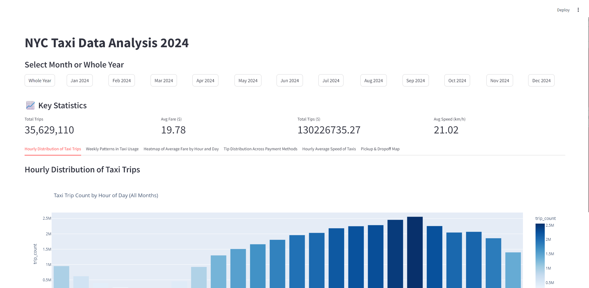
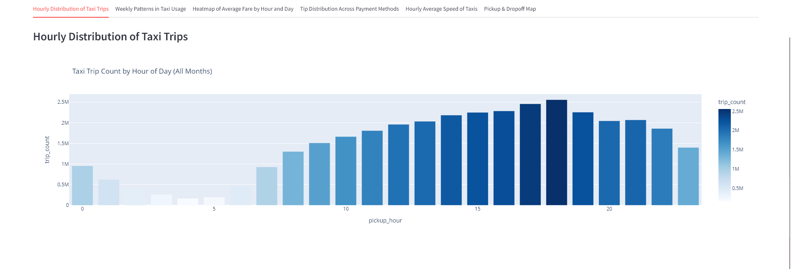
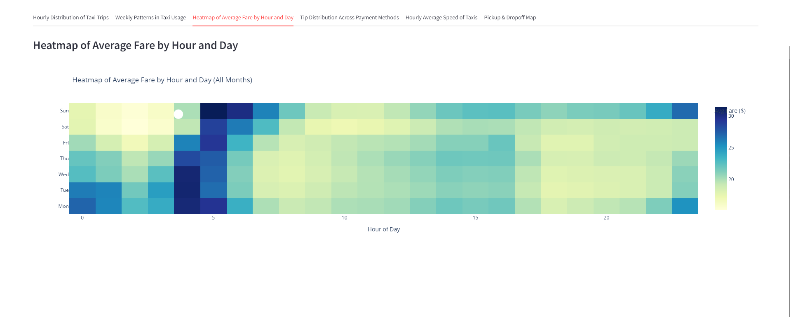
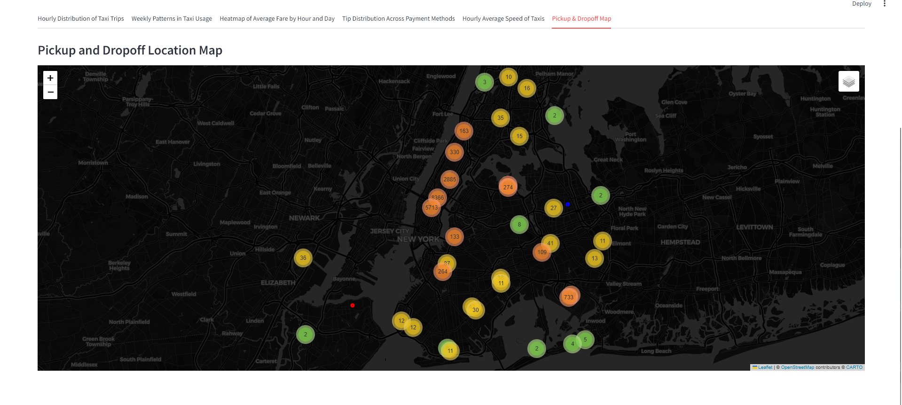

# NYC Taxi Data Hadoop Analysis with Dashboard

This project provides an interactive dashboard for exploring New York City taxi trip data. It includes various visualizations like hourly trip distribution, weekly trends, average fare heatmaps, tip patterns, and spatial maps of pickups and dropoffs. The app is built using Streamlit and powered by PySpark for efficient large-scale data processing.

## Screenshots

### Dashboard Overview


### Hourly Trip Distribution


### Average Fare bt Hour and Day Heatmap


### Pickup/DropOff Map


## Technologies Used

### Big Data & Processing
- **Apache Hadoop** - Distributed storage and processing framework
- **Apache Spark (PySpark)** - Large-scale data processing and analytics
- **HDFS** - Hadoop Distributed File System for data storage

### Development & Analytics
- **Python 3.8+** - Primary programming language
- **Jupyter Notebook** - Interactive development and analysis
- **Pandas** - Data manipulation and analysis
- **NumPy** - Numerical computing

### Visualization & UI
- **Streamlit** - Web application framework for the dashboard
- **Plotly** - Interactive plotting and visualization
- **Folium** - Interactive maps and geospatial visualization
- **GeoPandas** - Geospatial data processing

### Infrastructure & Deployment
- **Docker** - Containerization platform
- **Docker Compose** - Multi-container application orchestration

### Data Format & Storage
- **Apache Parquet** - Columnar storage format for efficient querying
- **GeoJSON** - Geographic data interchange format

## Database Schema (Parquet Data)

The NYC Taxi data contains columns such as:
- `tpep_pickup_datetime` (timestamp): Pickup time
- `tpep_dropoff_datetime` (timestamp): Dropoff time
- `passenger_count` (int): Number of passengers
- `trip_distance` (float): Distance of trip in miles
- `fare_amount` (float): Fare in USD
- `tip_amount` (float): Tip in USD
- `payment_type` (int): Payment method code
- `PULocationID` (int): Pickup location zone ID
- `DOLocationID` (int): Dropoff location zone ID

Additional fields may be present depending on the dataset version.

## Features

- Hourly and weekly usage analysis
- Fare and tip insights across payment methods
- Interactive heatmaps and folium-based location maps
- Monthly or full-year selection for filtered analysis
- Summary statistics display (trip count, fare, speed, etc.)

## Challenges Encountered

- **HDFS setup and file management:** Uploading parquet files to HDFS inside Docker required manual setup of directories and permissions.
- **PySpark environment:** Ensuring PySpark and related dependencies worked correctly within the container environment.
- **Coordinate transformations:** Mapping zone IDs to geographic coordinates required handling projections and merging GeoJSON data with trip data.
- **Performance:** Processing large datasets efficiently with Spark and sampling for Folium maps to keep them responsive.
- **Interactive visualizations:** Integrating Plotly and Folium with Streamlit required saving plots as HTML and embedding them correctly.

## Team Members

* [Chihabeddine Zitouni](https://github.com/chihab4real)
* [Patrick Molina](https://github.com/patrickmolina1/)

## How to Run

### 1. Clone the Repository

```bash
git clone https://github.com/chihab4real/nyc-taxi-hadoop-analysis
cd nyc-taxi-hadoop-analysis
```

### 2. Download Data

Get the yellow taxi trip data (in .parquet format) from [NYC TLC Trip Record Data](https://www.nyc.gov/site/tlc/about/tlc-trip-record-data.page) and place it into the `shared/data/` folder.

### 3. Start the Hadoop + Spark Cluster

```bash
docker-compose up -d
```

### 4. Move Data to HDFS

Enter the namenode container:
```bash
docker exec -it namenode bash
```

Inside the container:
```bash
hdfs dfs -mkdir -p /nyc_taxi
hdfs dfs -put /shared/data/*.parquet /nyc_taxi/
```

### 5. Open Jupyter Notebook

Open your browser and go to http://localhost:8888

### 6. Precompute Visualizations

After moving the data files to HDFS, run the visualization precomputation in the Jupyter notebook terminal:
```bash
python generate_plots.py
```

### 7. Launch the Streamlit App

Run the following command:
```bash
streamlit run app.py
```

Then open in your browser: http://localhost:8501/

## Folder Structure

```
nyc-taxi-hadoop-analysis/
├── shared/
│   └── data/               # Raw parquet files
├── saved_plots/
│   └── YYYY-MM/            # HTML plots and summary for each month
├── notebooks/
│   └── analysis.ipynb      
├── screenshots/            # Dashboard screenshots
├── get_plots_month.py      # Spark-based preprocessing and visualization generator for 1 month
├── generate_plots.py       # Visualization generator for all months
├── app.py                  # Streamlit dashboard
├── docker-compose.yml
├── config/
└── README.md
```

## Requirements

```bash
pip install streamlit pandas geopandas pyspark plotly folium
```

## System Requirements

### Hardware Requirements
- **RAM**: Minimum 8GB, recommended 16GB+ for large datasets
- **Storage**: At least 10GB free space for data and Docker images
- **CPU**: Multi-core processor recommended for Spark processing

### Software Requirements
- **Docker** (version 20.0+)
- **Docker Compose** (version 1.27+)
- **Python** 3.8 or higher
- **Git** for repository management

## Prerequisites

- Docker and Docker Compose
- Python 3.8+
- At least 8GB RAM recommended for processing large datasets

## Architecture Overview

```
┌─────────────────┐    ┌──────────────────┐    ┌─────────────────┐
│   Raw Data      │    │   Hadoop/Spark   │    │   Streamlit     │
│   (.parquet)    │───▶│     Cluster      │───▶│   Dashboard     │
│                 │    │                  │    │                 │
└─────────────────┘    └──────────────────┘    └─────────────────┘
         │                       │                       │
         │                       │                       │
         ▼                       ▼                       ▼
┌─────────────────┐    ┌──────────────────┐    ┌─────────────────┐
│   NYC TLC       │    │   PySpark        │    │   Interactive   │
│   Trip Records  │    │   Analytics      │    │   Visualizations│
│                 │    │                  │    │                 │
└─────────────────┘    └──────────────────┘    └─────────────────┘
```

## Data Sources

- [NYC Taxi & Limousine Commission Trip Record Data](https://www.nyc.gov/site/tlc/about/tlc-trip-record-data.page)
- NYC Taxi Zone Shapefiles for geographic mapping

## License

This project is open source and available under the [MIT License](LICENSE).